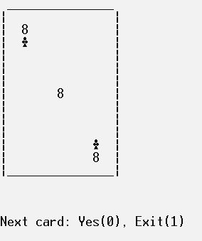

# Random playing card

## Description

Random playing card is a console app written in C programming language. It shows a random card every time is asked to. Uses the **srand()** function in order to generate random characters and symbols.

## Usage
- Can be directly opened from **random_playing_card.exe** and raw code is in the **random_playing_card.c** file.

- Press 0 to get another card or 1 to exit.

## License

[MIT](https://choosealicense.com/licenses/mit/)
